# Arcana - 당신의 마음을 듣고 읽어주는 타로 프렌즈

## 목차

- [프로젝트 진행 기간](#프로젝트-진행-기간)

- [Arcana 개요](#arcana-개요)

- [주요 기술 (Service Architecture)](#주요-기술-service-architecture)

- [핵심 기술](#핵심-기술)

- [협업 툴 및 환경](#협업-툴-및-환경)

- [팀원](#팀원)

- [서비스화면](#서비스-화면)

- [프로젝트 산출물](#프로젝트-산출물)  
  
   

## 프로젝트 진행 기간

2023.04.10(월) ~ 2023.05.19(금) (총 6주)

 

## Arcana 개요

Arcana(이하 아르카나)는 가벼운 질문부터 개인적인 고민까지 타로로 운세를 보고 고민을 해결해주는 종합 타로 서비스입니다.
기존 서비스들은 단순한 인스턴스 방식을 제공하는 것이 대부분이였습니다.

저희 서비스는 단순한 형태의 운세를 제공하는 것이 아닌 고차원적인 타로 해석을 제공하고 있습니다. 그리고 귀여운 캐릭터들이 운세를 봐준다는 컨셉으로 친근한 이미지를 가지고 있습니다.

 

아르카나는

- 켈틱크로스
- 연간, 월간 운세
- 양자, 삼자택일

와 같이 다양한 방식을 제공하고 있습니다.  
 

## 메뉴 구조도

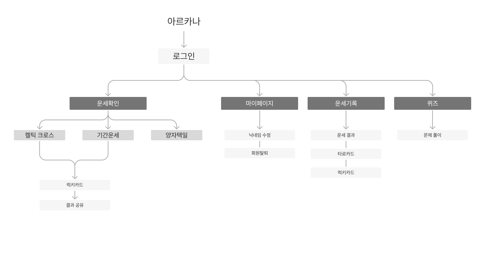
 

## 주요 기술 (Service Architecture)

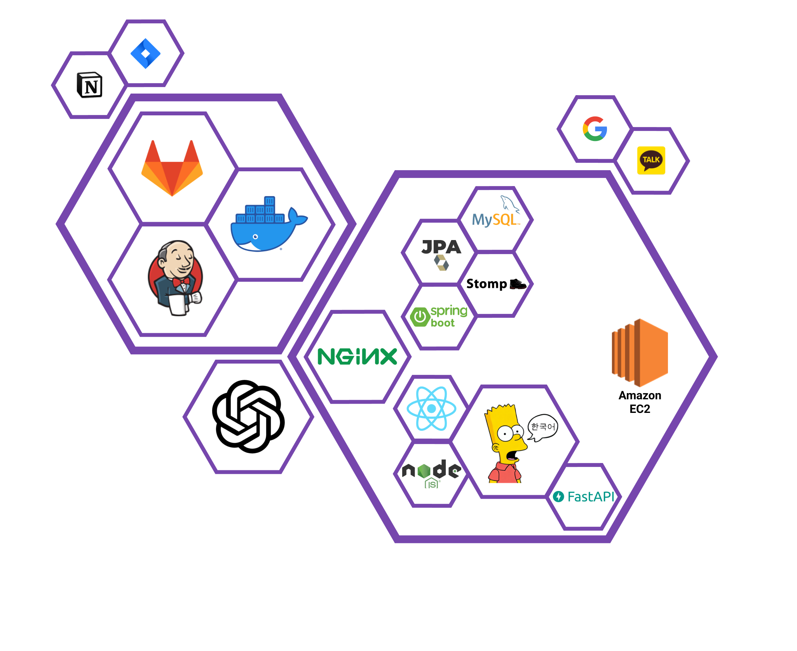

 

## 핵심 기술

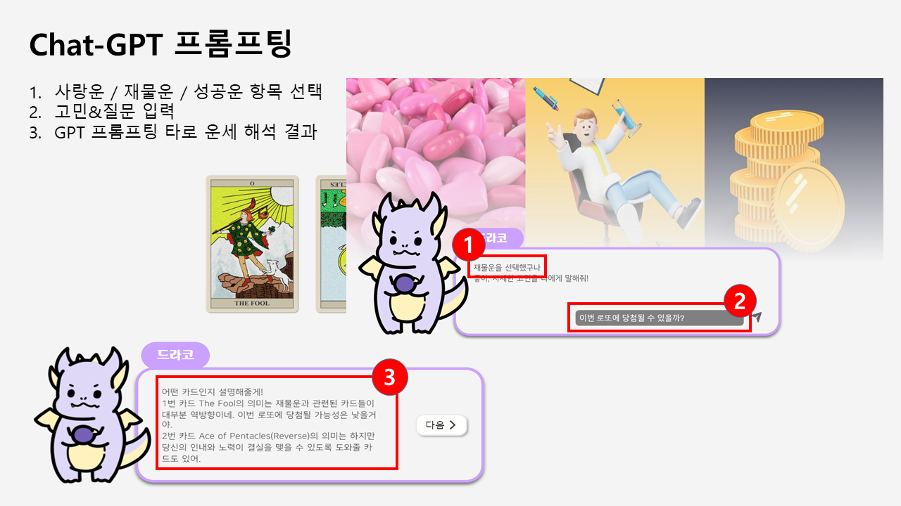

 

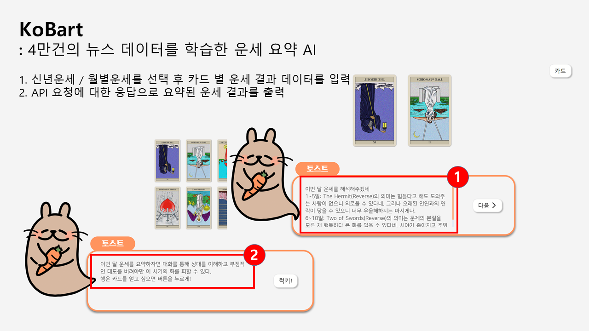

 

## 협업 툴 및 환경

### Git

- 코드 버전 관리
- Convention을 정하여 규칙에 맞게 Commit 메세지 작성

### Jira

- 매주 월요일 이슈 등록하여 Sprint 진행
- Story Point 설정하여 1주 40point 기준으로 진행
- In-Progress -> Done 순으로 진행

### Notion

- 이슈와 진행상황 공유 및 회의록 작성
- Convention 정리
- 공유해야 하는 문서 정리

### 그 외

- MatterMost
- Webex

## 팀원

### 이정윤

- 팀장
- FE
- 기획
- 타로 데이터 제작

### 강인주

- FE
- 디자인
- 소셜 로그인

### 최지훈

- FE
- 카드 모션
- BGM, SE

### 전상하

- BE
- AI (GPT, KoBart)

### 전은수

- BE
- DB
- CI / CD

## 서비스 화면

### 홈페이지

웹페이지의 홈 화면입니다.  
왼쪽 상단에서 로그인 후 서비스 이용이 가능합니다.  
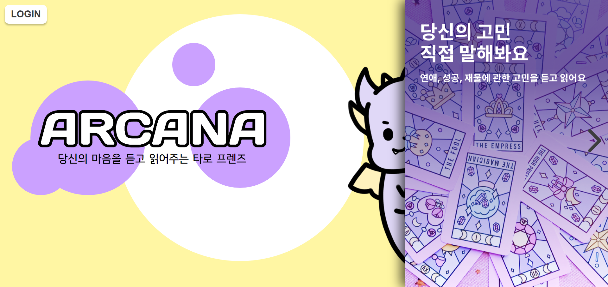
  

### 로그인

로그인 화면입니다.
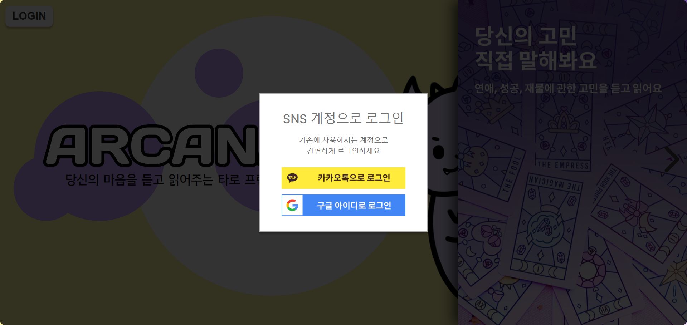
  

### 사이드바

로그인 후 햄버거 버튼을 누르면 활성화되는 사이드바입니다.
 
주간 티켓과 이벤트 티켓은 운세 확인 시 소비되는 자원입니다.
 
주간 티켓은 매 주마다 5개씩 채워지며 이벤트 티켓은 특정 시간에 발생하는 퀴즈 이벤트에서 획득 가능합니다.
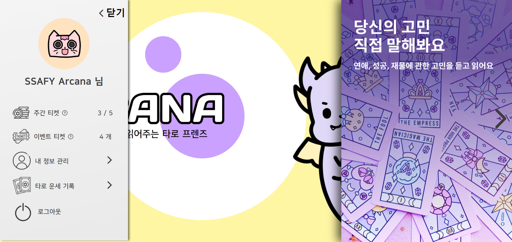
  

### 운세 확인 방법

1. 켈틱 크로스  
   10장의 카드를 이용하여 진행합니다. 사랑, 성공, 재물에 관한 고민을 입력할 수 있습니다.
   
     
2. 기간운세  
    신년운세 혹은 월별운세를 확인할 수 있습니다.
   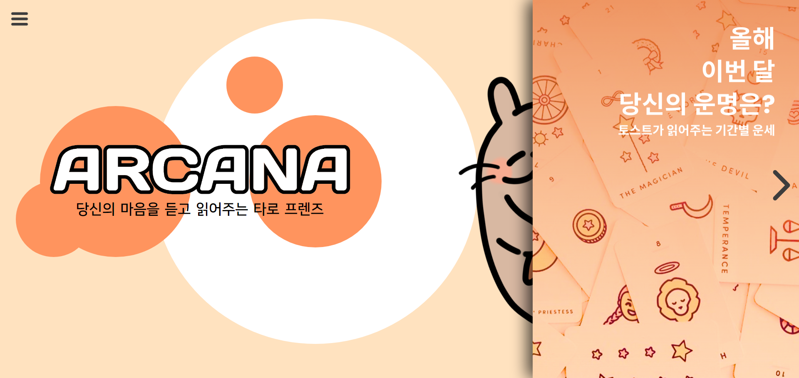
     
3. 양자택일  
    2개 혹은 3개 사이를 선택할 때 도움을 줄 수 있습니다.
   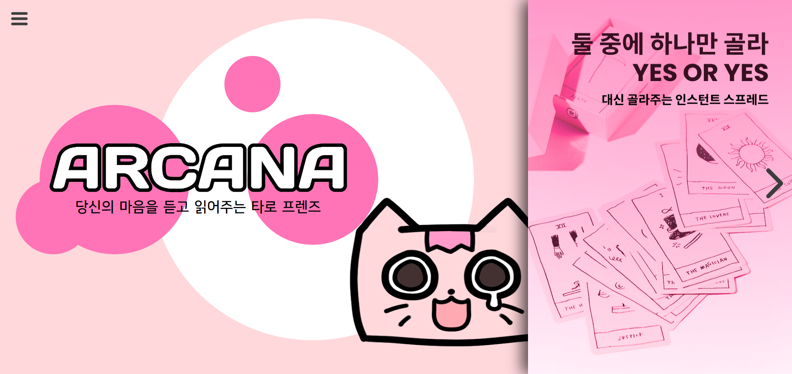
     

### 질문 입력

켈틱 크로스로 진행합니다. 질문을 입력할 수 있습니다.
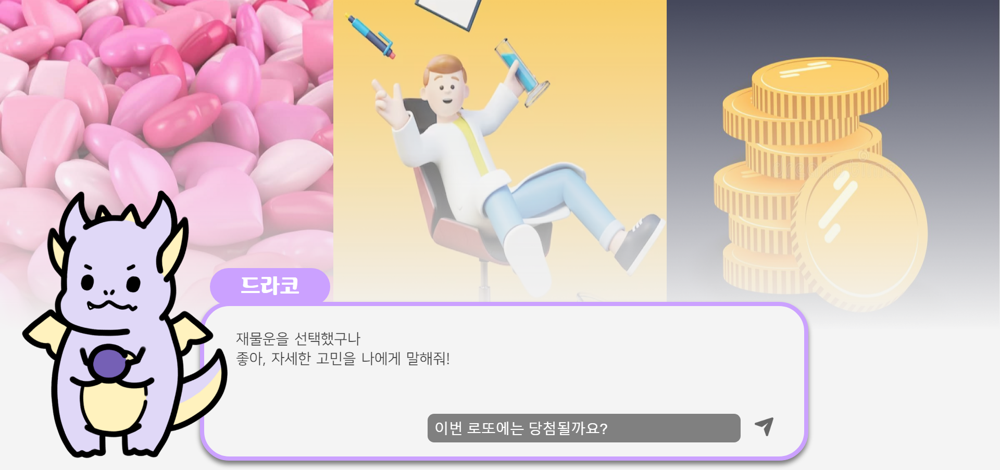  
 

### 카드 선택 및 결과 확인

선택할 수 있는 카드가 흐트러집니다.
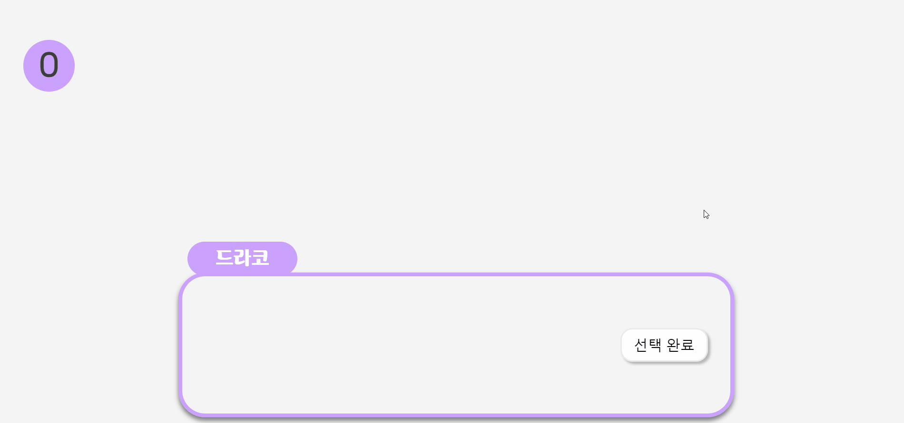  
 

총 10장을 선택합니다.
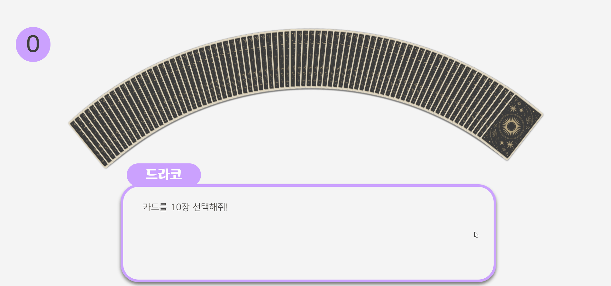  
 

선택이 완료되면 카드가 이동합니다.
  
 

카드별로 해석을 진행합니다
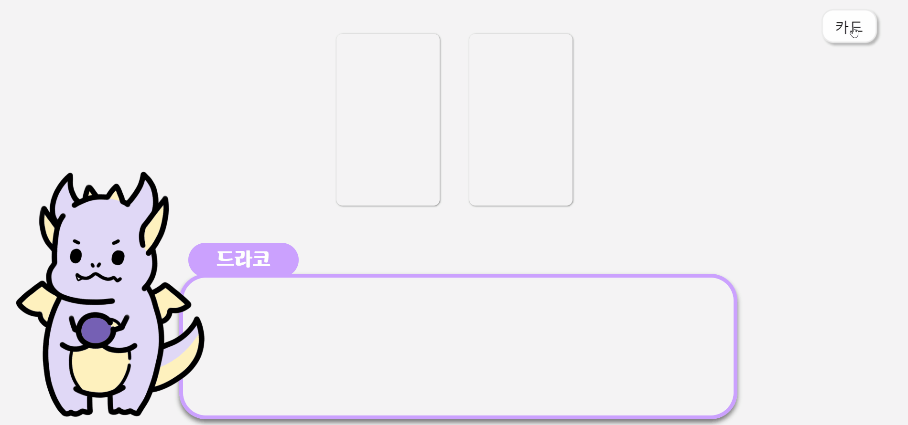  
 

### 럭키 카드

최종 확인 후 럭키 카드를 선택합니다.
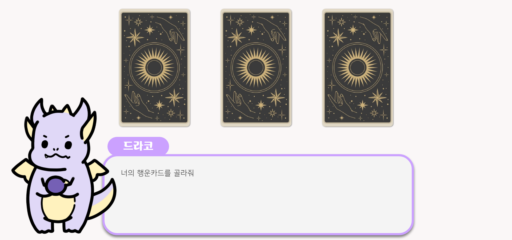  
 

선택된 럭키 카드를 공유할 수 있습니다.
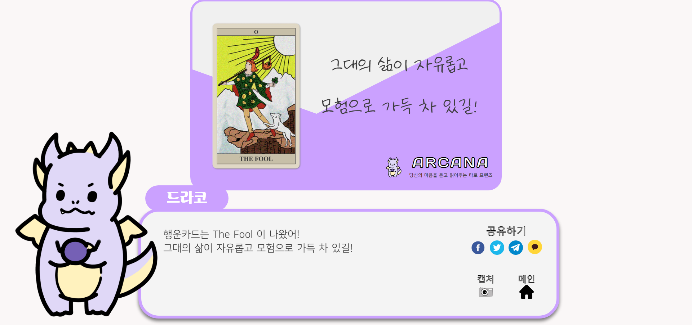

### 퀴즈

특정 시간에만 참여 가능한 퀴즈 이벤트입니다. 타로카드와 관련된 문제풀이를 진행합니다.
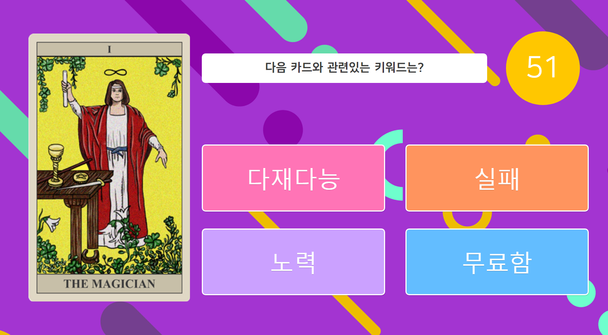  
 

정답인 경우 다음 문제로 진행할 수 있습니다.
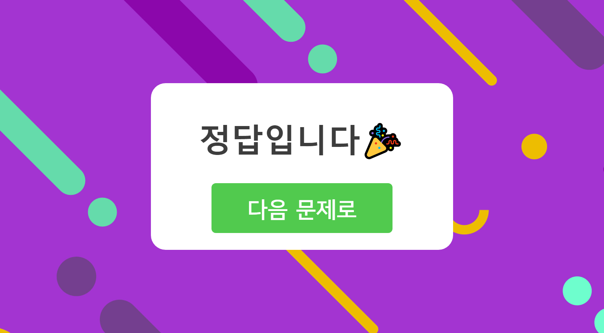  
 

10문제를 모두 맞히지 못하면 탈락합니다.
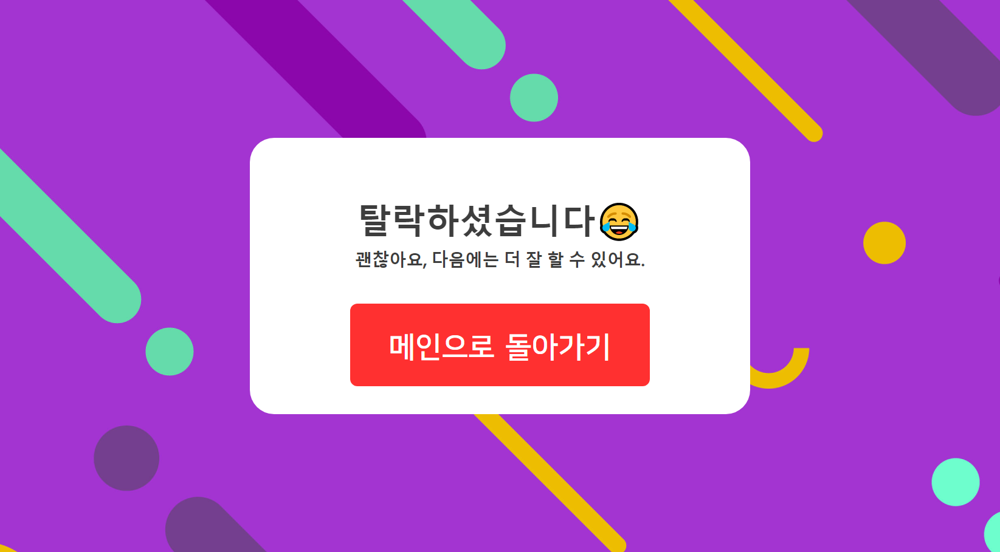  
 

10문제를 모두 맞히면 보상을 받을 수 있습니다. 이 티켓은 타로카드 운세를 볼 때 소비됩니다.
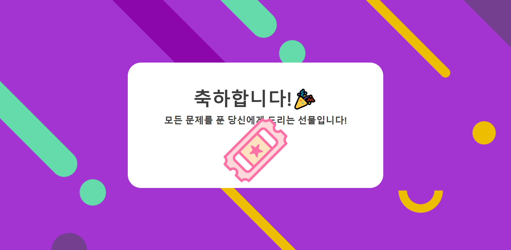  
 

## 프로젝트 산출물

- 메뉴 구조
- Git 전략
- Service Architecture
- Convention
- API 명세서
- ERD
- 회의록
- 중간 발표자료
- 최종 발표자료
